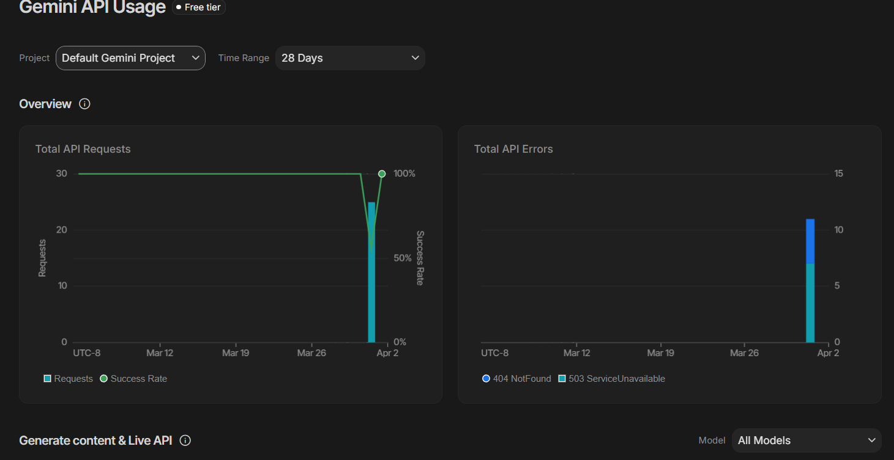
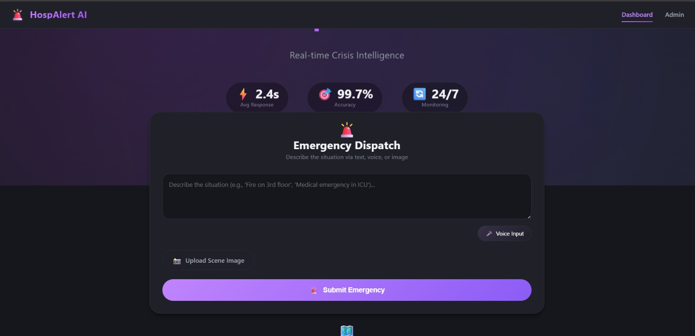
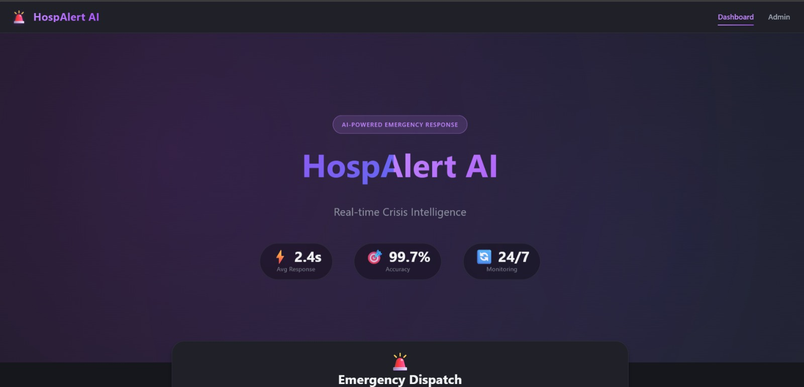
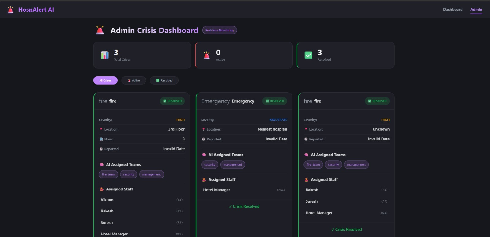

 # Rapid Crisis Sync

## Problem Statement
Design a robust solution to instantly detect, report, and synchronize crisis response efforts across a decentralized hospitality ecosystem. Eliminate fragmented communication by creating a highly reliable bridge between distressed individuals, active personnel, and emergency services.

## Project Description
This is an AI-powered crisis synchronization platform that acts as a real-time "Digital Twin" of a facility to eliminate fragmented communication. When a guest triggers an SOS, Lumen analyzes the building's layout, available emergency resources (e.g., AEDs, extinguishers), and live staff locations. 

The system instantly triages the emergency , auto-dispatches the nearest qualified personnel. All of this is synchronized in sub-seconds to a live command dashboard, bridging the gap between a guest's panic and a coordinated, highly reliable staff response.

---

## Google AI Usage
### Tools / Models Used
- Google Gemini 3 Flash
- `google-genai` Python SDK

### How Google AI Was Used
Google Gemini acts as the "Intelligence Engine" and central crisis commander of the application. 

Instead of relying on rigid, pre-programmed rules, Gemini dynamically ingests a JSON representation of the building's digital twin (including live staff coordinates, resource locations, and safety protocols) alongside the guest's natural language SOS report. Gemini instantly reasons over this spatial and procedural data to output a strict JSON rescue plan. It categorizes the severity, generates actionable life-saving instructions for the guest, and identifies the exact staff member and resource best suited to handle the specific crisis.

---

## Proof of Google AI Usage
Attach screenshots in a `/proof` folder:



---

## Screenshots 
Add project screenshots:

  



---

## Demo Video
Upload your demo video to Google Drive and paste the shareable link here (max 3 minutes).
[Watch Demo](https://drive.google.com/file/d/1kkDJb10RCDSUhYIztc0YCLeS1w1cAe-Y/view?usp=drive_link)

---

## Installation Steps

```bash
# Clone the repository
git clone https://github.com/Manu080405/Gsoc-Hackathon.git

# 1. Setup the AI  (FastAPI)
cd backend
pip install fastapi uvicorn google-generativeai pydantic
uvicorn main:app --reload

# 2. Setup the Orchestrator (Express)
# Open a new terminal
cd frontend
npm install
npm run dev

